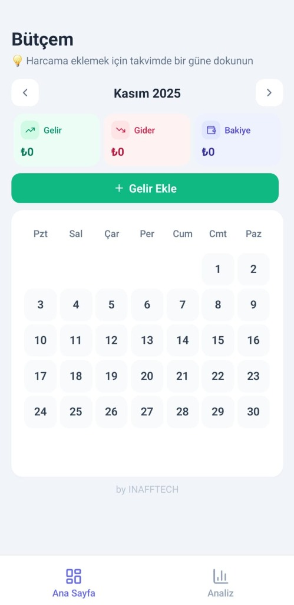
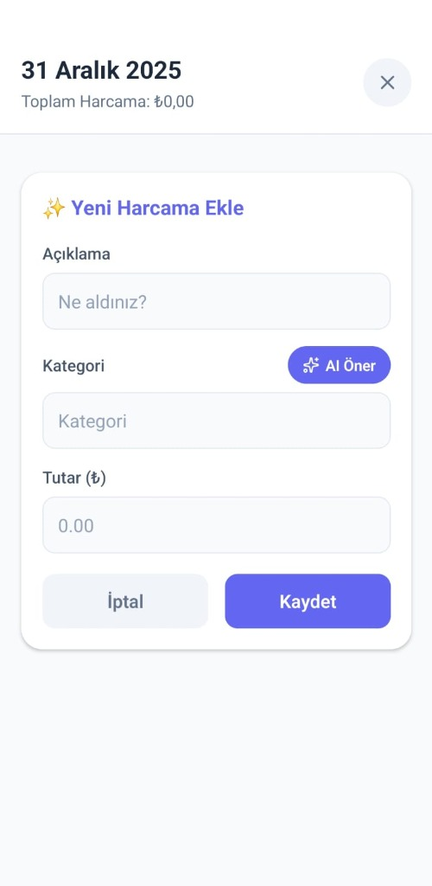
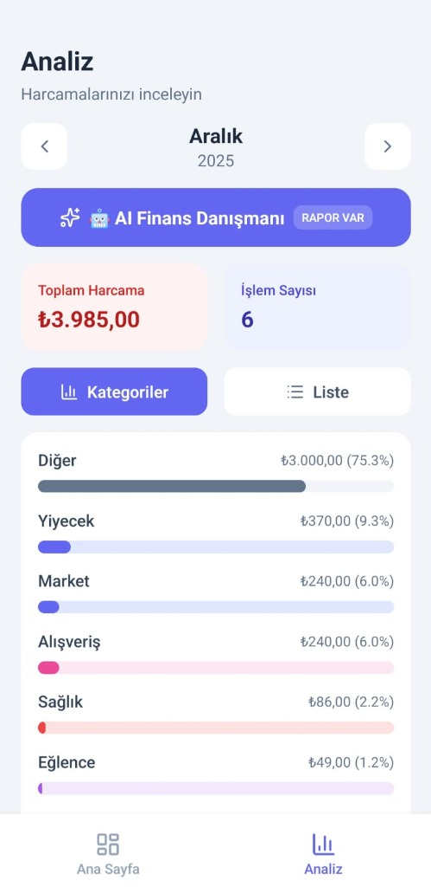
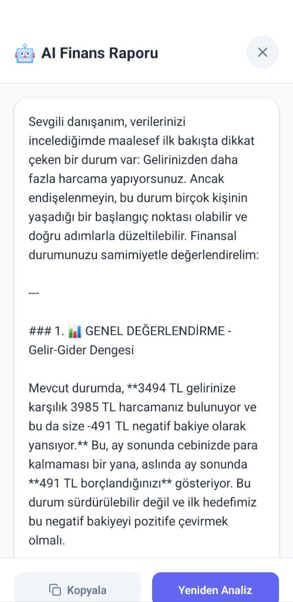

# 💰 Bütçem - Kişisel Finans Yönetim Uygulaması

<p align="center">
  
</p>

<p align="center">
  <strong>Akıllı bütçe takibi, yapay zeka destekli finansal danışmanlık</strong>
</p>

<p align="center">
  
  
  
  
</p>

---

## 📱 Uygulama Görselleri

<p align="center">
  
  
  
  
</p>

---

## ✨ Özellikler

### 📅 Takvim Tabanlı Gelir/Gider Takibi
- Aylık takvim görünümünde harcamalarınızı görüntüleyin
- Tek dokunuşla gelir veya gider ekleyin
- Anlık bakiye hesaplaması

### 🤖 AI Destekli Kategori Önerisi
- Harcama açıklaması girdiğinizde yapay zeka otomatik kategori önerir
- Google Gemini AI entegrasyonu
- Akıllı kategorizasyon ile zaman tasarrufu

### 📊 Detaylı Analiz Ekranı
- Aylık harcama dağılımını görselleştirin
- Kategori bazlı analiz
- İşlem sayısı ve toplam harcama özeti

### 🧠 AI Finans Danışmanı
- Kişiselleştirilmiş finansal analiz raporu
- Gelir-gider dengesi değerlendirmesi
- Tasarruf önerileri ve aksiyon planı
- Türkçe, samimi ve profesyonel raporlama

### 💾 Yerel Veri Depolama
- SQLite ile güvenli yerel depolama
- İnternet bağlantısı gerektirmez (AI özellikleri hariç)
- Verileriniz cihazınızda kalır

---

## 🛠️ Teknolojiler

| Teknoloji | Açıklama |
|-----------|----------|
| **React Native** | Cross-platform mobil uygulama geliştirme |
| **Expo** | Geliştirme ve build yönetimi |
| **TypeScript** | Tip güvenli JavaScript |
| **SQLite** | Yerel veritabanı |
| **Google Gemini AI** | Yapay zeka entegrasyonu |
| **EAS Build** | Cloud-based uygulama derleme |

---

## 🚀 Kurulum

### Gereksinimler
- Node.js 18+
- npm veya yarn
- Expo CLI
- Android Studio (Android build için)

### Adımlar

```bash
# Repoyu klonlayın
git clone https://github.com/enqinsel/butcem.git

# Proje dizinine gidin
cd butcem

# Bağımlılıkları yükleyin
npm install

# Geliştirme sunucusunu başlatın
npx expo start
```

### Build Alma

```bash
# Android AAB (Google Play için)
eas build --platform android --profile production

# Android APK (Test için)
eas build --platform android --profile preview
```

---

## 📂 Proje Yapısı

```
butcem/
├── app/                    # Ana uygulama ekranları
│   ├── (tabs)/            # Tab navigasyonu
│   │   ├── index.tsx      # Ana sayfa (Takvim)
│   │   └── analysis.tsx   # Analiz ekranı
├── components/            # Yeniden kullanılabilir bileşenler
├── services/              # Veritabanı ve API servisleri
├── assets/                # Görseller ve fontlar
├── app.json              # Expo yapılandırması
└── eas.json              # EAS Build yapılandırması
```

---

## 🔧 Yapılandırma

### Gemini API Anahtarı
`app.json` dosyasında `extra.GEMINI_API_KEY` değerini kendi API anahtarınızla değiştirin:

```json
"extra": {
  "GEMINI_API_KEY": "YOUR_API_KEY_HERE"
}
```

---

## 📄 Lisans

Bu proje MIT lisansı altında lisanslanmıştır. Detaylar için [LICENSE](LICENSE) dosyasına bakın.

---

## 👨‍💻 Geliştirici

**INAFTECH**

- 🌐 Website: [inaftech.com](https://inaftech.com)
- 📧 Email: info@inaftech.com

---

<p align="center">
  Made with ❤️ by INAFTECH
</p>
